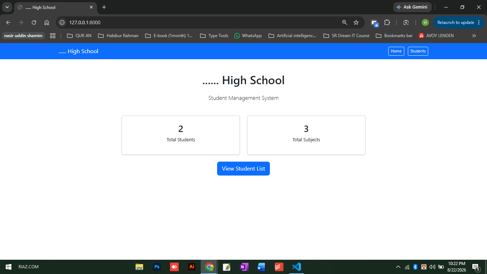
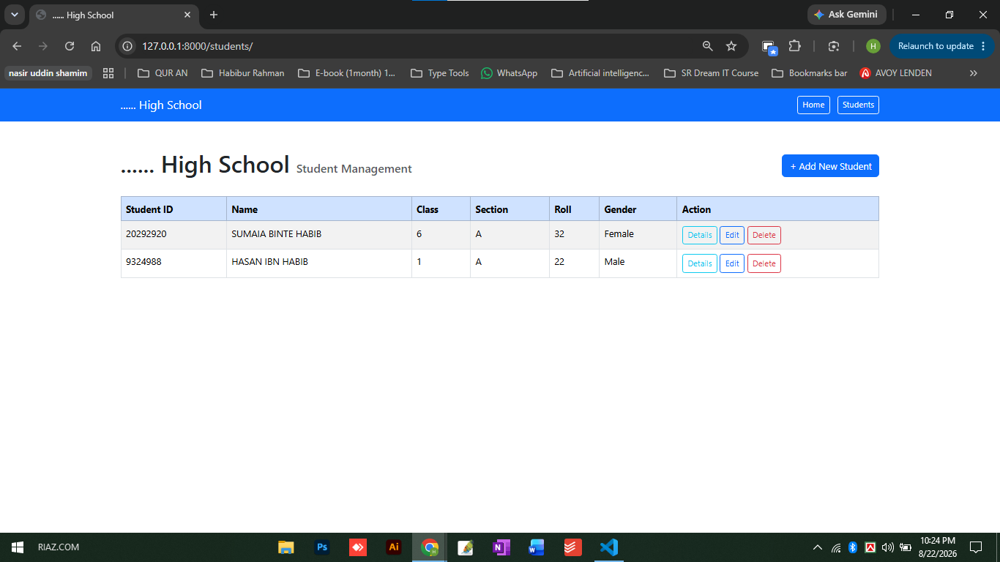
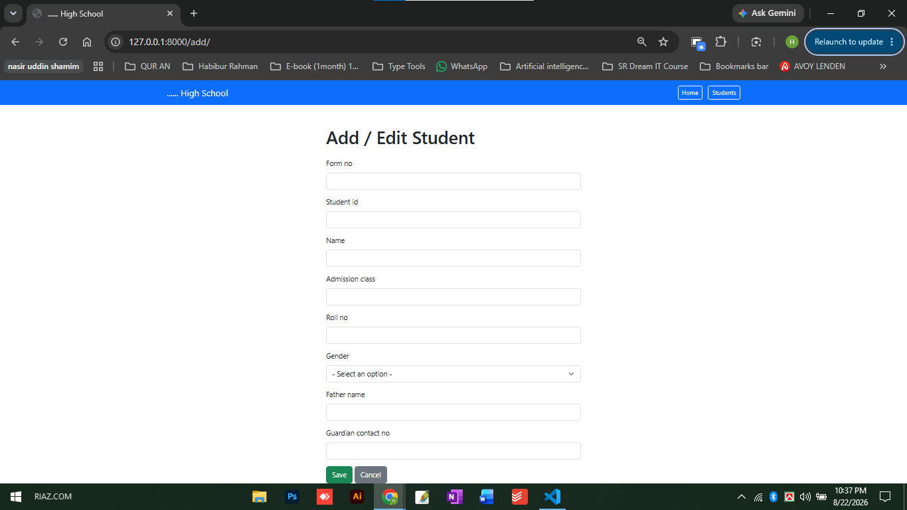
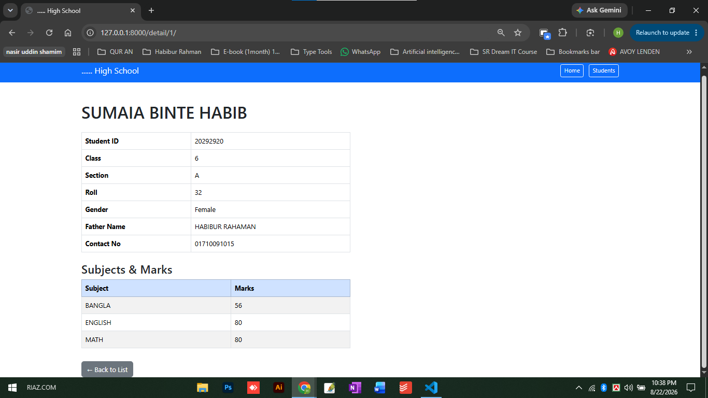

# School Management System (Django)
A web-based Student Management System built with Python and Django, inspired by real-world school administration software. This project demonstrates core full-stack web development skills including database design, CRUD operations, and form handling.

## 🔗 Live Demo
- **Website:** https://school-management-system-27mn.onrender.com/
- **Admin Panel:** https://school-management-system-27mn.onrender.com/admin/

> Note: Hosted on Render free tier — first load may take 30-50 seconds to wake up.

## Features
- **Student Management (Full CRUD)**
  - Add new student records through a web form
  - View all students in a structured list
  - Edit existing student information
  - Delete student records with confirmation
- **Subject Management**
  - Store subject details (code, name, full marks)
- **Student-Subject Relationship**
  - Track which subjects each student is enrolled in, along with their marks
- **Search**
  - Search students by name, roll, or class
- **Admin Panel**
  - Full Django admin interface for data management
  - Inline subject/marks entry when adding a student
  - Custom branded admin header

## Tech Stack
- **Backend:** Python, Django 6.1
- **Database:** SQLite (development)
- **Frontend:** HTML, CSS, Bootstrap 5 (Django Templates)
- **Deployment:** Render.com (Gunicorn)
- **Version Control:** Git & GitHub

## Screenshots
### Dashboard

### Student List

### Add Student Form

### Student Detail

## Project Structure
